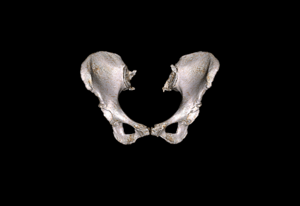
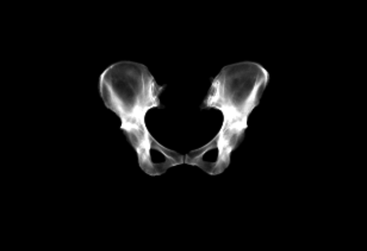
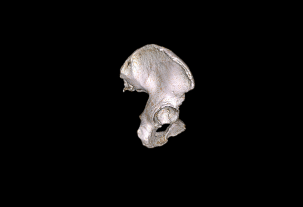
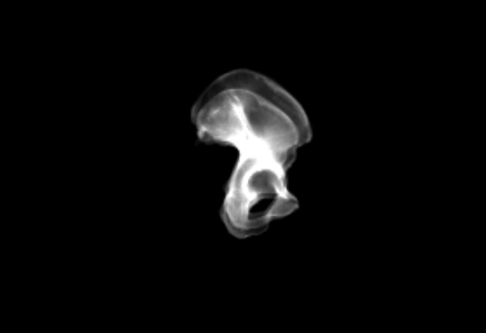
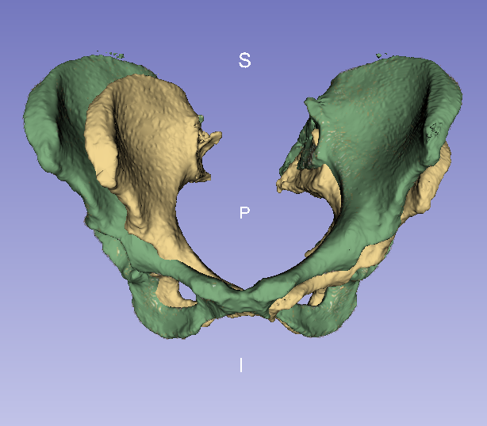
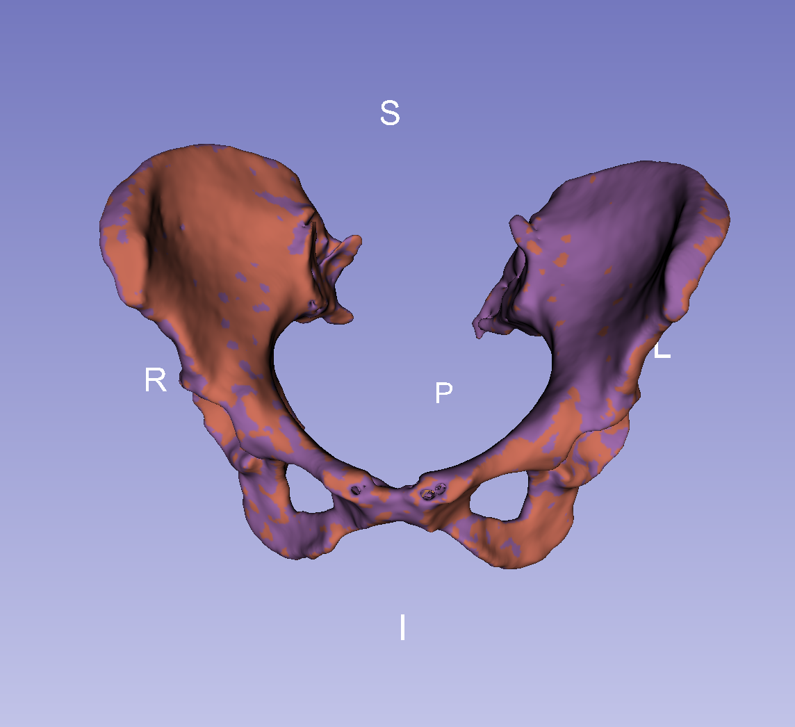

# Cpu-Midas-Journal-800

The Most Beautiful Tool to Understand or Realize the registration on medical images
2D/3D Registration using itk framework

<p align="center">
    
    
</p>

<p align="center">
Volume Projection Anteroposterior View
</p>

<p align="center">
    
    
</p>

<p align="center">
Volumen Projection Lateral View.
</p>


<p align="center">
    
    
</p>

<p align="center">
Before and After Registration Process
</p>

## Test registration process by default using all specific commands

```
./multiTesting -numImag 3 -originVol ../inputData/pelvisVol.mha -targetVol ../inputData/ImagesDefsNews/Images/0.mha -compareVols -writeStatistics
```

## Specific Deformation or Relocated in volumetric template (Synthetic Images)
```
./CreateImageSetSimilarity  -v -folderName ../outputData/ImagesDefs -numImages 1 -rx 20.0 -ry 0.0 -rz 0.0 -t 0.0 0.0 0.0 -sg 1.0 -inputVol ../inputData/pelvisVol.mha -logFileName logRelocatedVolume.txt
```

## Specific Generation of Virtual Images
```
./genVirtualImage -v -p AP -dc 90 0 0 -foc 0 -1000 0 -scd -124 -res 1 1 -size 333 245 -threshold 100 -o pelvisHealthy_ap -inputVol ../outputData/ImagesDefsNews/Images/0.mha -logFileName logVirtualImage_ap.txt
```
```
./genVirtualImage -v -p ML -dc 90 90 0 -foc 1000 0 0 -scd -200 -res 1 1 -size 181 245 -threshold 100 -o pelvisHealthy_ml -inputVol ../inputData/ImagesDefsNews/Images/0.mha -logFileName logVirtualImage_ml.txt
```

## Specific Registration between 2 X-Ray Image and 3D Volume
```
./MultiImageRegistration -movingImage ../inputData/pelvisSegmIntensityLPI.mha -numFixedImages 2 -f0 ../outputData/virtualImages/pelvisHealthy_ap_0.mha 0 -1000 0 -f1 ../outputData/virtualImages/pelvisHealthy_ml_0.mha 1000 0 0 -steptolerance 0.02 -stepsize 4.0 -numLevels 3 -schedule 4 2 1 -outputDirectory ../outputData/resultsReg/ -logfilename logMultiRegistration.txt
```
## Visual Cost Function
```
./DoCostFunction -movingImage ../inputData/pelvisVol.mha -numFixedImages 2 -f0 ../outputData/virtualImages/pelvisHealthy_ap_0.mha 0 -1000 0 -f1 ../outputData/virtualImages/pelvisHealthy_ml_0.mha 1000 0 0 -transfMovingImage ../outputData/resultsReg_0/outTransform.txt -indImagenEval 0 -typePlot 2D -indParam 0 3 -rangex 3 2 -step -0.1 0.3
```

## Visual Register
```
./VisualRegister -dirResultsReg ~/Desktop/BienHechoChristian/outputDataImag0/ -movingImage ../inputData/pelvisVol.mha -indRegistro 0 -numLevels 4 -p AP -dc 90 0 0 -foc 0 -1000 0 -threshold 100 -scd -124 -o pelvisDif
```

<table align="center">
<tr>
    <td></td>
    <td></td>
    <td></td>
    <td></td>
</tr>
<tr>
    <td></td>
    <td></td>
    <td></td>
    <td></td>

</tr>
<tr>
    <td></td>
    <td></td>
    <td></td>
    <td></td>
</tr>
</table>


Enjoy :wink:

Soon GPU implementation

<p align="center">
     <a href = 'https://www.youtube.com/watch?v=-P28LKWTzrI&t=16s'>
        
     </a>
</p>


