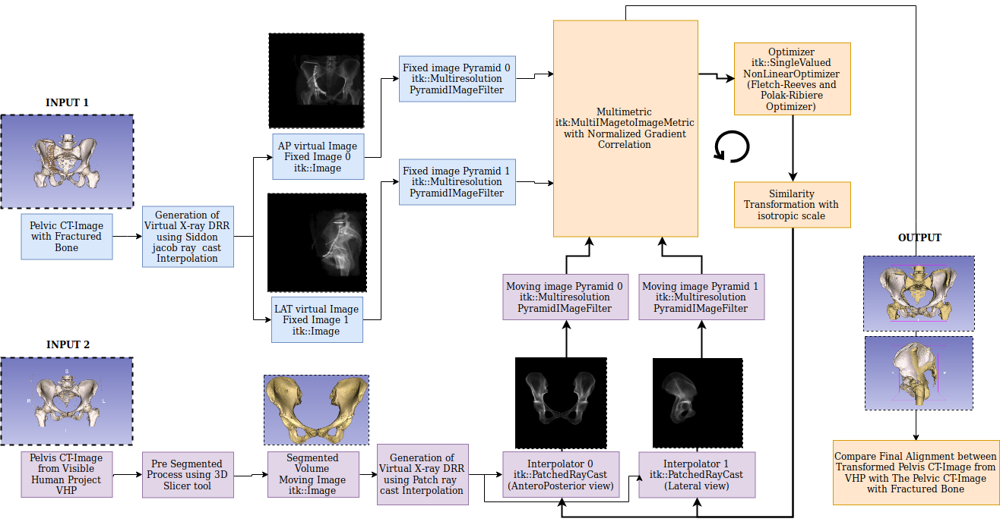
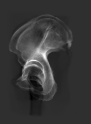
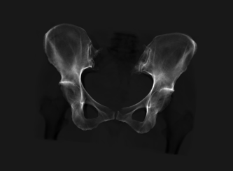
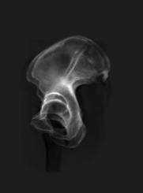
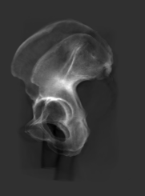

# 2D/3D Registration Tool
Tool to understand some topics on medical image registration


#Previous Work

The whole process is following the scheme of work of Bertelsen A., Borro D. An ITK-Based Framework for 2D-3D Registration with Multiple Fixed Images http://insight-journal.org/browse/publication/800. it was tested in the thorax bone

It was oriented firstly to assist in the radiotherapy by I. M. J. van der Bom https://www.researchgate.net/publication/278408614_Evaluation_of_optimization_methods_for_intensity-based_2D-3D_registration_in_x-ray_guided_interventions, it consists to get the correct form of tumors when we displace the tomograph inserting into the tumor with slices, these slices should be correct and it should have a correct form when the tomograph inside the radiation on the illness part, in this case, it was applied on the brain.

#Summary

Currently in medical analysis needs accuracy data, physicians require computer tomographies (CT) or magnetic resonances (MRI) in order to set measures or make a diagnostic on 3D models of the anatomical structure but these images have a high cost and not all medical center has these equipment.


There exist other kind of images more accesible, x-ray images are used for quickly diagnostic but x-ray images don't have enough information, for this reason some works proposed use x-ray images and volumetric template in order to generate a specific 3D model like a CT or MRI.


In this work It used 2 orthogonal x-ray images to align a volumetric template for pelvic bone, it transforms 3D information to 2D information with Virtual X-ray images and uses registration for comparing on x-ray images and virtual x-ray images. The metric is based on pixel intensity information in order to change initial parameters of transformation for volumetric template alignment these changes are improved using an iterative method until reach the best alignment of the volumetric template.

I know that it is not a complete work due to the following points: 

* It work with simulated x-ray images from CT and not with real x-ray images because it is not common to get lateral views on hip bone there exist more anterposterior views. But It has the same properties as real x-ray (dimension, resolution, medical distances, orientacion and intensity information on medical images). 


* It needs a non rigid registration in order to achieve a local deformation on volumetric template and get a precisely and specific 3d model so it is only an alignment which is neccesarily in order to apply the non rigid registration.


* It needs to improve the computed time because it should be very quickly to get a 3D model it last between 6 or 7 minutes depending of the CPU.

* It has visual results but it need extra tools in order to visualize the 3d models in this case using itk-snap or 3D-Slicer.

I must work in these items.


The design of working is the next:

<p align="center">
    
</p>

So It generate virtual x-ray images form reference volume and volumetric template. 2 views are required (bilateral or orthogonal views)

<p align="center">
    
    
</p>

<p align="center">
Volume Projection Anteroposterior View
</p>

<p align="center">
    
    
</p>

<p align="center">
Volumen Projection Lateral View.
</p>


This is a superposition between Reference Volume (yellow color) and Volumetric Template (green color) before the registration process.
<p align="center">
    
</p>

This is a superposition between Reference Volume (purple color) and Volumetric Template (pink color) after the registration process.


<p align="center">

</p>


# Applications

The next are some applications in order to do a registration process. Every command has a list of attributes which are in the implementation file. If you play with other attributes look at the implementation file.

## Apply registration process by default using all specific commands

> MultiTesting:  it creates a set of test using different reference volumes which are recolated at radom position

```c++
./multiTesting -numImag 3 -originVol ../inputData/pelvisVol.mha -targetVol ../inputData/ImagesDefsNews/Images/0.mha -compareVols -randMode -threshold 100 -writeStatistics
```

```
# Meaning of attributes: 
* -numImag:  number of test or generate a number random of 3D model relocate
* -originVol:  is the volumetric template which will be transformed
* -targetVol: is the Reference Volume which is recolated in random positions.
* -randMode: activate seed in order to generate different random numbers.
* -threshold: interval of intensity on x-ray images.
* -compareVols: flag to use Hausdorff Distance to compare reference and template
* -writeStatistics: flag to show statistics in metric, difference of transformation parameters, correlation between metric and transformation value in every test and statistics for whole set of test.
```


## Specific Deformation or Relocated in volumetric template (Synthetic Images)

> It generates different reference volumes with random position saving the transformation which will be used in order to recolate the volume.

```
./CreateImageSetSimilarity  -v -folderName ../outputData/ImagesDefs -numImages 1 -rx 20.0 -ry 0.0 -rz 0.0 -t 0.0 0.0 0.0 -sg 1.0 -inputVol ../inputData/pelvisVol.mha -logFileName logRelocatedVolume.txt
```

```
# Meaning of attributes: 
* -v activate verbose mode in order to save a general information according to the process.
* -folderName is the directory where put the output volumes which are relocated.
* -numImages is how many new volumes will be generated with different position according to he input volume.
* -rx, -ry, -rz: they are rotation parameters
* -t It is the traslation parameter.
* -sg It is the scale parameter.
* -inputVol is the base volume which generates the new recolated volumes. (references volumes)
* -logFileName is the file where put all the information of the create recolated volumes
```


## Specific Generation of Virtual Images

>It generates virtual x-ray images from 3D model, it required some conditions according to the real x-ray image (dimension, spacing, orientation, distance from volume or source-xray)

```
./genVirtualImage -v -p AP -dc 90 0 0 -foc 0 -1000 0 -scd -124 -res 1 1 -size 333 245 -threshold 100 -o pelvisHealthy_ap -inputVol ../outputData/ImagesDefsNews/Images/0.mha -logFileName logVirtualImage_ap.txt
```
```
./genVirtualImage -v -p ML -dc 90 90 0 -foc 1000 0 0 -scd -200 -res 1 1 -size 181 245 -threshold 100 -o pelvisHealthy_ml -inputVol ../inputData/ImagesDefsNews/Images/0.mha -logFileName logVirtualImage_ml.txt
```

```
# Meaning of attributes: 
* -v activate verbose mode for more information about the process
* -p It is the what view do you want (AP view or ML view)
* -dc It is the orientation on x-ray image that you set.
* -foc It is the coordinate of focal point, it should be according to the orientation of the 3D model.
* -scd It is the distance from projection plane and center of the 3d model.
* -res It is the resolution or spacing on x-rau image.
* -size It is the dimension or number of pixels in every axis.
* -threshold It is the threshold of intensity applied on 3D model.
* -o It is the name of the output file (x-ray image result)
* -inputVol It is the 3D model which produce the virtual x-ray
* -logFileName It is the name of verbose output file.
```


## Specific Registration between 2 X-Ray Image and 3D Volume

> It only makes one registration process using the before commands.

```
./MultiImageRegistration -movingImage ../inputData/pelvisSegmIntensityLPI.mha -numFixedImages 2 -f0 ../outputData/virtualImages/pelvisHealthy_ap_0.mha 0 -1000 0 -f1 ../outputData/virtualImages/pelvisHealthy_ml_0.mha 1000 0 0 -steptolerance 0.02 -stepsize 4.0 -numLevels 3 -schedule 4 2 1 -outputDirectory ../outputData/resultsReg/ -logfilename logMultiRegistration.txt
```
```
# Meaning of attributes: 
* -movingImage It is the 3d model which will be transformed according to 2 x-ray images
* -numFixedImages It is the quantity of x-ray images or How many views do you want.
* -f0 It is the first fixed image or x-ray image and should have the focal point coordinate. in this case (0 -1000 0)
* -f1 It is the second fixed image or x-ray image and should have the focal point coordinate, in this case (1000 0 0)
* -steptolerance It is the threshold of change of transformation parameters updating
* -stepsize It is the change size of the transformation parameters
* -numLevels It is the number of levels of resolution
* -logFileName It is the output information file.
```


## Visual Cost Function

>It helps to analize the cost function (metric in optimization process) varying the transformation parameters 

```
./DoCostFunction -movingImage ../inputData/pelvisVol.mha -numFixedImages 2 -f0 ../outputData/virtualImages/pelvisHealthy_ap_0.mha 0 -1000 0 -f1 ../outputData/virtualImages/pelvisHealthy_ml_0.mha 1000 0 0 -transfMovingImage ../outputData/resultsReg_0/outTransform.txt -indImagenEval 0 -typePlot 2D -indParam 0 3 -rangex 3 2 -step -0.1 0.3
```

```
# Meaning of attributes: 
* -movingImage is the input volumetric template which was used in the registration process.
* -numFixedImage is the quantity of fixed images (x-ray images) in order to make the registration
* -f0 first fixed image with its focal point coordinate (0 -1000 0)
* -f1 second fixed image with its focal point coordinate (1000 0 0)
* -indImagenEval It is the fixed image that you choose to analize
* -typePlot It is the type of plot, It could be 2D for only one fixed image
* or use both fixed images to produce 3D plot of cost function vs parameters.
* -indParam It is what parameter has chosen for every fixed image. The order of parameters are (rx,ry,rz,tx,ty,tz,sg).
* -rangex It is the changing interval of transformation paramete. It is applied for one fixed image. If you want 3D plot use additionally -rangey.
* -step is how many change the interval in every range
```

## Visual Register

> It build some animation in order to visualize the process registration

```
./VisualRegister -dirResultsReg ~/Desktop/BienHechoChristian/outputDataImag0/ -movingImage ../inputData/pelvisVol.mha -indRegistro 0 -numLevels 4 -p AP -dc 90 0 0 -foc 0 -1000 0 -threshold 100 -scd -124 -o pelvisDif
```

```
# Meaning of attributes: 
* -dirResultsReg It is the directory of registration results generated by ./multiTesting command.
* -movingImage It is the volumetric template in order to generate the registration results.
* -indRegistro It is the number of registration result that you want.
* -numLevels It is the number of levels of resolution in this case 4
* -p It is the view of the animation.
* -dc It is the orientation of virtual x-ray
* -foc It is the focal point coordinate of virtual x-ray
* -threshold It is the threshold of virtual x-ray
* -scd It is the distance from volume to projection plane
* -o It is the name base of the images to create a gif animation.
```
This is some result using the Visual Register command

<table align="center">
<tr>
    <td></td>
    <td></td>
    <td></td>
    <td></td>
</tr>
<tr>
    <td></td>
    <td></td>
    <td></td>
    <td></td>

</tr>
<tr>
    <td></td>
    <td></td>
    <td></td>
    <td></td>
</tr>
</table>


Enjoy :wink:

Soon GPU implementation

<p align="center">
     <a href = 'https://www.youtube.com/watch?v=-P28LKWTzrI&t=16s'>
        
     </a>
</p>


